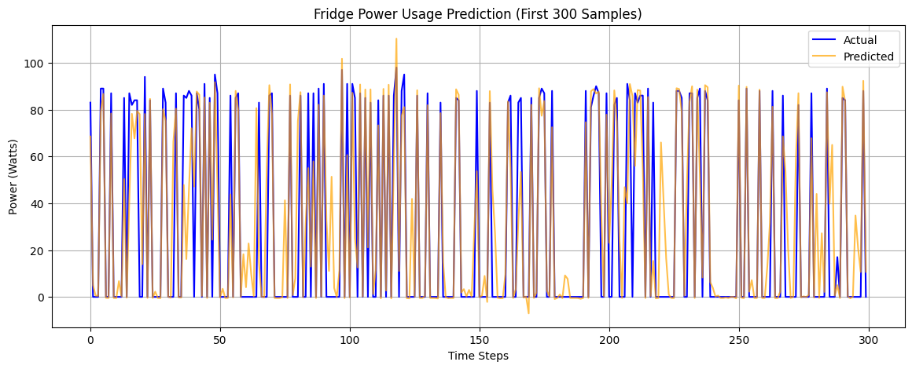
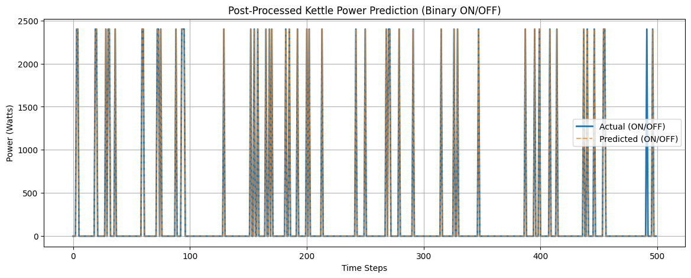

# 🔌 NILM with LSTM + Transformer (UK-DALE)

This project implements a deep learning pipeline for **Non-Intrusive Load Monitoring (NILM)** using a combination of **LSTM** and **Transformer** layers to disaggregate individual appliance power consumption from total household mains electricity readings. The project focuses on two appliances:

* 🧊 **Fridge** (continuous usage pattern)
* ☕ **Kettle** (rare, short, high-power bursts)

---

## 📂 Dataset

* **Source:** UK-DALE (UK Domestic Appliance-Level Electricity)
* **Building:** 1
* **Sample period:** 6 seconds
* **Access via:** [NILMTK](https://nilmtk.github.io/)

---

## 🔧 Model Architecture

A hybrid **LSTM + Transformer (seq2point)** model:

* Input: 99 past `mains` readings
* Output: Power usage of the target appliance at the center of the window

### Components:

* `LSTM`: Captures sequential power patterns
* `TransformerEncoder`: Adds attention to handle time dependencies
* `Linear Layer`: Final regression output

---

## ⚙️ Preprocessing Steps

1. Load `mains` and `appliance` (fridge/kettle) active power
2. Align timestamps and remove NaNs
3. Clip power spikes (e.g., `kettle > 3000W` removed and `Fridge > 200` removed)
4. Normalize data using `MinMaxScaler`
5. Create `seq2point` style sliding windows (length = 99)
6. Train-test split (80/20)

---

## 🧪 Training Strategy

| Appliance  | Notes                                                          |
| ---------- | -------------------------------------------------------------- |
| **Fridge** | Continuous output prediction (regression)                      |
| **Kettle** | Post-processed into binary ON/OFF states due to bursty pattern |

* Balanced the kettle training data by oversampling ON events
* Used `Optuna` for hyperparameter tuning (5 trials)

---

## 🧠 Post-Processing for Kettle

To better model the kettle's binary behavior:

* Predictions > 300W were converted to `2400W` (ON)
* Others set to `0W` (OFF)

This significantly improved both MAE and MAPE.

---

## 📊 Results

### Fridge (Regression)

* MAE: **12.40W**
* MAPE: **\~2.0%**

### Kettle (Post-Processed Binary)

* MAE: **16.13W**
* MAPE: **1.87%**

---

## 📈 Sample Prediction Graphs

### 🔹 Fridge: Actual vs Predicted

### 🔹 Kettle: Actual vs Predicted (Binary)

> Note: These graphs show a 300-sample segment comparing true vs predicted appliance usage.

---

## 📦 Tools & Libraries

* Python
* PyTorch
* NILMTK
* scikit-learn
* Optuna
* NumPy, Pandas, Matplotlib

---

## 📈 Future Work

* Extend to more appliances (e.g., microwave, washing machine)
* Explore sequence-to-sequence architectures
* Deploy a real-time NILM dashboard

---

## 📬 Author

> **Tanmay Mishra**
> Machine Learning & Data Science Enthusiast
